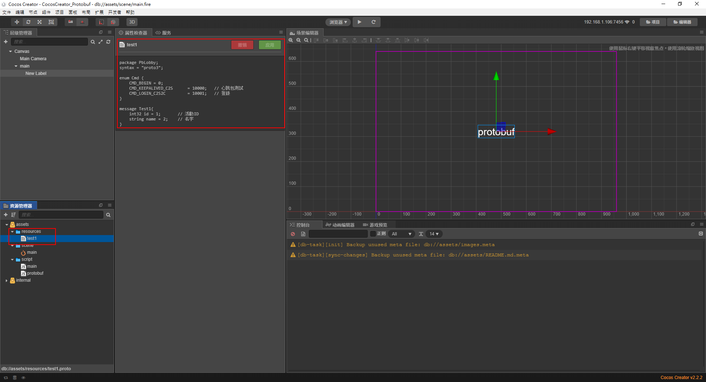

# CocosCreator & protobuf

動手實作練習

本案例為動態加載proto檔(protobuf3)，透過protobuf.js，去實際protobuf

# 下載protobuf

[下載地址](https://github.com/protobufjs/protobuf.js/releases)


# 需設為插件


# test1.proto要放置動態加載的目錄



test1.proto
```c++
package PbLobby;
syntax = "proto3";

enum Cmd {
    CMD_BEGIN = 0;
    CMD_KEEPALIVED_C2S      = 10000;   // 心跳包測試
    CMD_LOGIN_C2S2C         = 10001;   // 登錄
}

message Test1{
    int32 id = 1;       // 活動ID
    string name = 2;    // 名字
}
```

# 增加一個testProtobuf函數

可以放在onLoad()、或onStart()作執行

```js
onLoad() {
        this.testProtobuf();
    },
```

```js
testProtobuf: function () {
        if (cc.sys.isNative) {
            cc.log("jsb.fileUtils=" + jsb.fileUtils);
            jsb.fileUtils.addSearchPath("res/raw-assets/resources", true);
        }

        var filename1 = "test1.proto";

        // 导入为插件，直接使用
        var protobufHere = protobuf;

        // 使用protobuf.js加載test1.proto檔案
        protobufHere.load(filename1, function (err, root) {//Data/PbLobby.proto
            if (err)
                throw err;

            // 將加載成功的資源丟到root，這裡讀到的是一堆protobuf.js的函數
            cc.log("root=" + root);
            for (var i in root) {
                cc.log("root." + i + "=" + root[i]);
            }
            //return;

            cc.log("加载protobuf.js完毕，开始测试protobuf...")

            // 使用lookupEnum捉取test1.proto package裡面的PbLobby的cmd
            var cmd = root.lookupEnum("PbLobby.Cmd");
            // cmd是一個結構體
            cc.log("@@@cmd: ",cmd);
            // 轉成json格式
            cc.log(`cmd = ${JSON.stringify(cmd)}`);
            // 使用其中的常數
            cc.log("CMD_KEEPALIVED_C2S = "+cmd.values.CMD_KEEPALIVED_C2S);

            // lookup 等价于 lookupTypeOrEnum 
            // 不同的是 lookup找不到返回null,lookupTypeOrEnum找不到则是抛出异常
            // 這裡PbLobby.Cmd1會回傳null
            var type1 = root.lookup("PbLobby.Cmd1");
            cc.log("type1 = "+type1);
            var type2 = root.lookup("PbLobby.Test1");
            cc.log("type2 = "+type2);

            // 取得PbLobby.Test1的類型
            var Test1Message = root.lookupType("PbLobby.Test1");
            cc.log("Test1Message = "+Test1Message);

            // 定義一個要傳送的結構體
            var payload = { id: 1,name:"hello protobuf" };
            cc.log(`payload = ${JSON.stringify(payload)}`);

           
            // 过滤掉一些message中的不存在的字段
            var message = Test1Message.create(payload);             
            cc.log(`message = ${JSON.stringify(message)}`);

            // 編碼成protobuf格式
            var buffer = Test1Message.encode(message).finish();
            cc.log("buffer1 = "+buffer);
            cc.log(`buffer2 = ${Array.prototype.toString.call(buffer)}`);

            // 解碼
            var decoded = Test1Message.decode(buffer);
            cc.log("decoded1 = "+decoded);
            cc.log(`decoded2 = ${JSON.stringify(decoded)}`);
        });
    },

```

# 修改protobuf.js的源代碼，搜索function fetch(filename, options, callback)，修改為

```js
function fetch(filename, options, callback) {
    if (typeof options === "function") {
        callback = options;
        options = {};
    } else if (!options)
        options = {};

    if (!callback)
        return asPromise(fetch, this, filename, options); // eslint-disable-line no-invalid-this

    if (typeof cc !== "undefined") {//判断是否是cocos项目

        if (cc.sys.isNative) {//native
            var content = jsb.fileUtils.getStringFromFile(filename);
            //对于一些新版的creator(作者creator2.3.2)来说，他会把资源混淆在不同的目录下，所以这里是没办法找到该文件的,直接使用cc.loader的loadRes方法尝试加载一次。
            if(content === ""){
                cc.loader.loadRes(filename, cc.TextAsset, function (error, result) {
                    cc.log("error1=" + error + ",result = " + result + ",type=" + typeof result);
                    if (error) {
                        callback(Error("status " + error))
                    } else {
                        //callback(null, result);//creator1.9及以下版本使用此行
                        callback(null, result.text);//新版creator可放心运行
                    }
                });
            } else {
                callback(content === "" ? Error(filename + " not exits") : null, content);
            }
        } else {
            //cc.log("cc.loader load 1 filename=" + filename);
            //这里可以加载一个url图片 : "Host"+filename
            // cc.loader.load(filename, function (error, result) {
            //     cc.log("error1=" + error + ",result = " + result + ",type=" + typeof result);
            //     // callback(null, result);
            // });
            //cc.log("cc.loader load 2");

            // 这里h5会去加载resources目录下的文件 : "resources/"+ filename
            // 这里filename一般不用指定扩展名,当然你也可以强制指定
            cc.loader.loadRes(filename, cc.TextAsset, function (error, result) {
                //cc.log("error2=" + error + ",result = " + result + ",type=" + typeof result);
                if (error) {
                    callback(Error("status " + error))
                } else {
                    //callback(null, result);//creator1.9及以下版本使用此行
                    callback(null, result.text);//新版creator可放心运行
                }
            });
            //cc.log("cc.loader load 3");
        }

        return;
    }

    // if a node-like filesystem is present, try it first but fall back to XHR if nothing is found.
    if (!options.xhr && fs && fs.readFile)
        return fs.readFile(filename, function fetchReadFileCallback(err, contents) {
            return err && typeof XMLHttpRequest !== "undefined"
                ? fetch.xhr(filename, options, callback)
                : err
                    ? callback(err)
                    : callback(null, options.binary ? contents : contents.toString("utf8"));
        });

    // use the XHR version otherwise.
    return fetch.xhr(filename, options, callback);
}
```

# 運行CocosCreator


# 思路整理

- Git捉取適合版本的protobuf.js，丟至CocosCreator為設置為插件
- 修改protobuf.js裡fetch(filename, options, callback)的方法
- 定義符合格式的proto檔，放置動態加載resources的資料夾
- 使用範例中testProtobuf中的方法，加載test1.proto及protobuf.js，進行protobuf的編碼、解碼
- 此案例會動態加載test1.proto的變化，例如在其中增加性別的字段，編碼時也加入該字段，在結果展示即會動態增加


# 參考網址

https://www.jianshu.com/p/01223c16279a